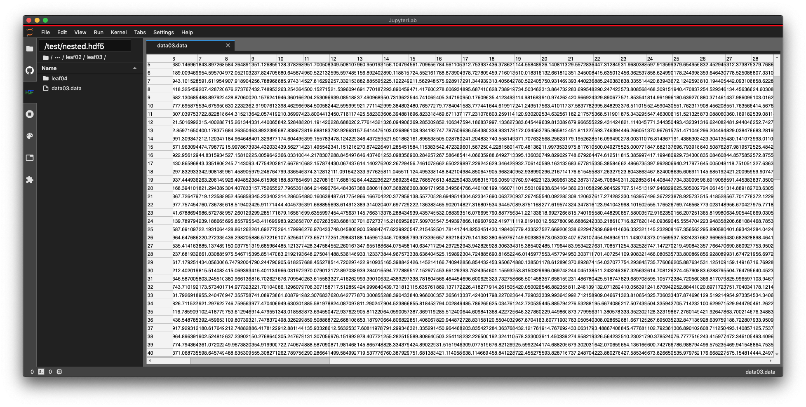

[![PyPI version][pypi]][pypi-url]
[![npm_version][npm]][npm-url]

[interactive api docs][swagger-url]

# jupyterlab-hdf5

Open and explore HDF5 files in JupyterLab. Can handle very large (TB) sized files. Now integrated with the standard filebrowser!



Currently in early release. Double clicking on an `.hdf5` file in the file browser will open it in a special HDF browser. You can then browse through the groups and open the datasets in the `.hdf5` file. All datasets will open read only.

For the moment, the browser context menu does not work with `.hdf5` files/groups/datasets. Only double clicking is currently supported.

Designed from the ground up to be as efficient as possible. Data will only be fetched as needed to create the visible display. This allows the extension to work with very large files, potentially up to the TB range.

## Installation

```bash
pip install jupyterlab_hdf
jupyter labextension install @jupyterlab/hdf5
```

This will install both the server extension and the labextension needed by this plugin.

You can also install the labextension via Jupyterlab's extension manager GUI. Keep in mind that if you use the GUI, you'll still need to install the `jupyterlab_hdf` server extension via `pip`.

## Development

For a development install, clone the repository and then run the following in the repo dir:

```bash
pip install .
jlpm build:dev
```

To watch for/rebuild on changes to this extension's source code, run:

```bash
jlpm run build:watch
```

## What's in this extension

This extension has two main parts: an hdf5 filebrowser plugin, and an hdf5 dataset file type plugin. It also has a plugin (in early development) that provides HDF5 support for the [`@jupyterlab/dataregistry`](https://github.com/jupyterlab/jupyterlab-data-explorer) labextension.

### HDF5 Filebrowser

Allows you to navigate an `.hdf5` file's groups as though they were directories in a filesystem. Any `.hdf5` file on a user's system can be opened by entering its path (relative to the Jupyterlab home directory) in the box at the top of the browser.

### HDF5 dataset file type

When you open a dataset using the hdf5 filebrowser, a document will open that displays the contents of the dataset via a grid.

### HDF5 DataRegistry support

The `@jupyterlab/dataregistry` extension allows for exploration of data in a very generalized way. If you have `@jupyterlab/dataregistry` installed, this plugin will supply HDF5 support for `dataregistry`.

## Status of the latest version

- filebrowser

  - features
    - allows you to a double click on an `.hdf5` file in the main file browser and open it in the new hdf browser
    - the hdf browser allows you to view the contents as groups and datasets and double click to open them
  - Some minor UI issues remain (mostly with the breadcrumbs).
  - The next goal is to get the browser context menus to work correctly with HDF5 types. This will likely require some changes to JupyterLab core, which are currently being investigated.

- dataset file type

  - features
    - data will load to the grid dynamically as needed
    - the grid can accessed as slices via the "Slice" UI
  - read only
  - the next goal is to enable selection/copying of a dataset's elements

- `@jupyterlab/dataregistry` support
  - features
    - allows the opening of `.hdf5` files, groups, and datasets in the `dataregistry` browser
    - offers functionality similar to that of the set of other plugins in this extension

[pypi]: https://badge.fury.io/py/jupyterlab-hdf.svg
[pypi-url]: https://badge.fury.io/py/jupyterlab-hdf
[npm]: https://badge.fury.io/js/%40jupyterlab%2Fhdf5.svg
[npm-url]: https://badge.fury.io/js/%40jupyterlab%2Fhdf5
[swagger-url]: https://petstore.swagger.io/?url=https://raw.githubusercontent.com/jupyterlab/jupyterlab-hdf5/master/jupyterlab_hdf/api/api.yaml
